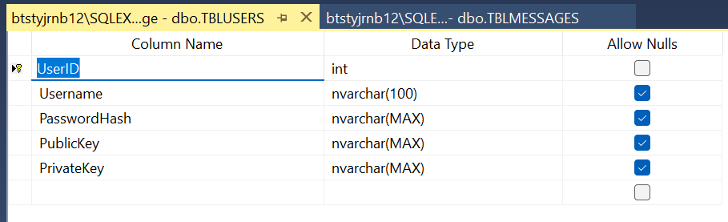
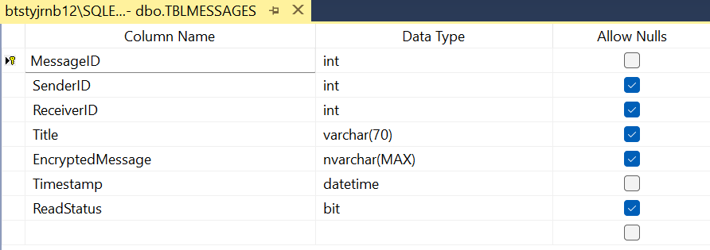
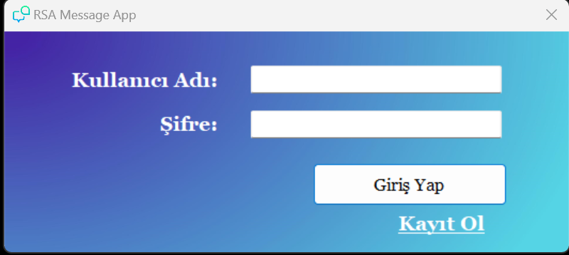
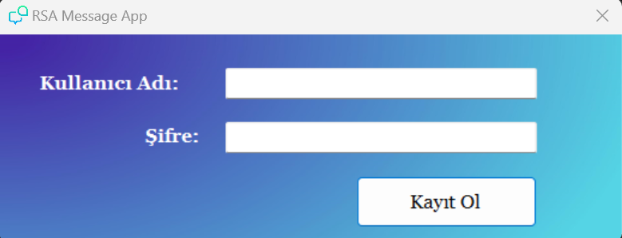
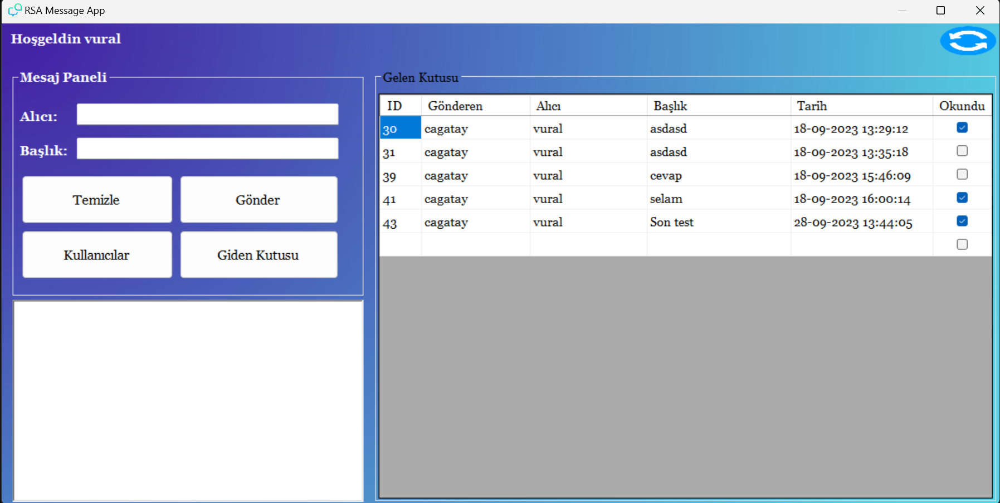
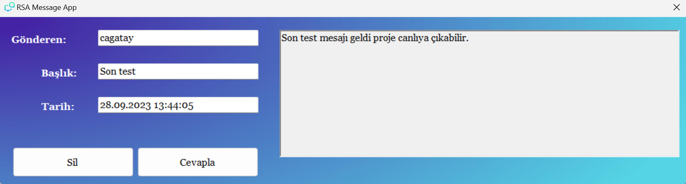

<h1 align="center">RSAMessageApp</h1>

  <strong>Güvenli Mesajlaşma Uygulaması</strong>

  <a href="#aciklama">Açıklama</a> •
  <a href="#gereksinimler">Gereksinimler</a> •
  <a href="#kurulum">Kurulum</a> •
  <a href="#kullanım">Kullanım</a> •
  <a href="#özellikler">Özellikler</a> •
  <a href="#ekran-görüntüleri">Ekran Görüntüleri</a> •
  <a href="#katkıda-bulunma">Katkıda Bulunma</a> •
  <a href="#lisans">Lisans</a>

---

## Açıklama

**RSAMessageApp**, güvenli iletişim amacıyla geliştirilmiş basit bir RSA şifreleme tabanlı mesajlaşma uygulamasıdır. Bu uygulama, metin mesajlarını şifrelemek ve güvenli bir şekilde göndermek isteyen kullanıcılar için tasarlanmıştır.

### Gereksinimler

Uygulamayı başlatmak için aşağıdaki gereksinimlere ihtiyacınız vardır:

- Windows işletim sistemi
- .NET Framework 4.5 veya daha üstü
- MSSQL Server 2019

### Kurulum

1. Bu deposu yerel makinenize kopyalayın veya ZIP olarak indirin.
2. Visual Studio veya Visual Studio Code gibi bir geliştirme ortamını kullanarak projeyi açın.
3. Veritabanınızda gerekli database ve tabloları oluşturun.
3. Projeyi derleyin ve başlatın.

## Kullanım

**RSAMessageApp** kullanımı oldukça basittir. İşte temel kullanım adımları:

1. Uygulamayı başlatın.
2. Kayıt olun veya mevcut bir hesapla oturum açın.
3. İletişim kurmak istediğiniz kullanıcının adını veya kullanıcı adını girin.
4. Güvende iletişim kurmaya başlayın.

## Özellikler

- RSA şifrelemesi tabanlı güvenli mesajlaşma.
- Gelen kutusu, giden kutusu, kayıtlı kullanıcı listesi.
- Kullanıcı dostu arayüz.
- Mesajlarınızı güvenli bir şekilde paylaşın.

## Ekran Görüntüleri

<table>
  <tr>
    <th>Kullanıcı tablosu</th>
     <th>Mesaj tablosu</th>
  </tr>
  <tr>
    <td></td>
    <td></td>
  </tr>
 </table>

 <table>
  <tr>
    <th>Giriş ekranı</th>
     <th>Kayıt ekranı</th>
  </tr>
  <tr>
    <td></td>
    <td></td>
  </tr>
 </table>

 <table>
  <tr>
    <th>Mesaj ekranı</th>
     <th>Mesaj detay ekranı</th>
  </tr>
  <tr>
    <td></td>
    <td></td>
  </tr>
 </table>

## Katkıda Bulunma

Bu projeye katkıda bulunmak isterseniz, lütfen bir çekme isteği gönderin. Katkılarınızı memnuniyetle karşılarız.

## Lisans

Bu proje MIT Lisansı altında lisanslanmıştır. Daha fazla bilgi için [LICENSE](LICENSE.txt) dosyasına bakın.
